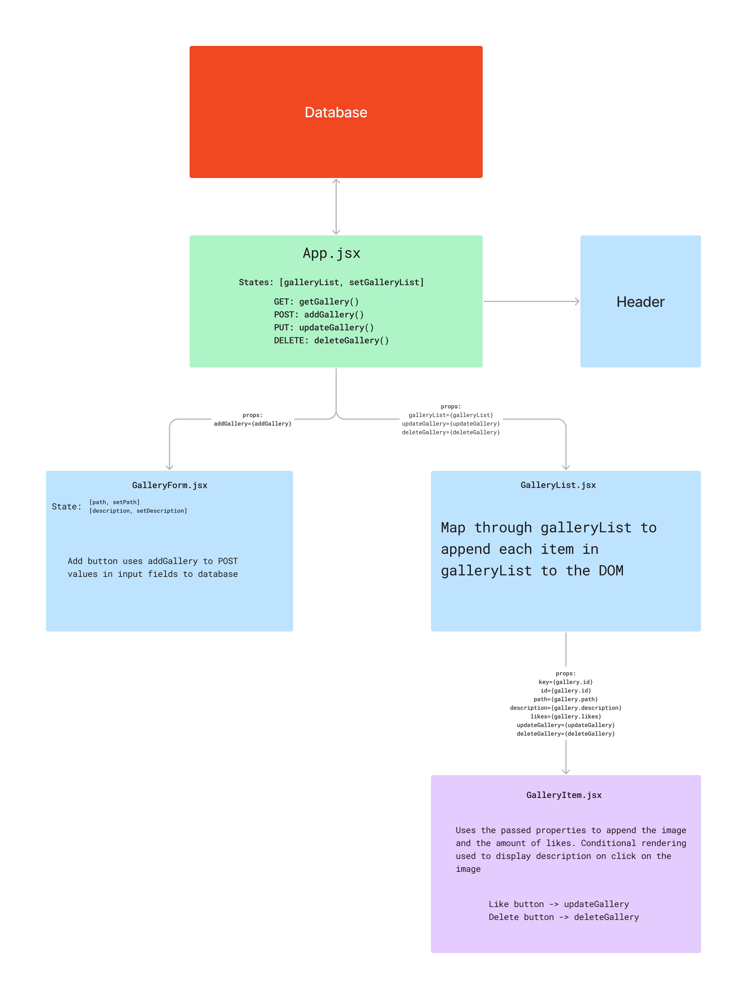

# React Photo Gallery:

## Description

_Duration: 12 hour Sprint_

Over the course of a weekend, the goal was to create a functional full-stack web based application. The web based application allow users to add images with a description to the gallery.

## Screen Shots
Preview:

GIF showing application features:

## Description & Approach

In order to tackle all the requirements for this project, I created a map of what I thought the structure of the project would look like. The map allowed me to keep track of what needed to be in each compenent and what properties I needed to pass through.

### Prerequisites
- [Node.js](https://nodejs.org/en/)
- [React.js](https://react.dev/)
- Express 
- Body-Parser
- 'PG'
- Database Manager

## Installation
1. Clone this repository for your own access.
2. Open up your editor of choice and run `npm install`
3. Using your preferred database manager. Use the provided SQL file to set up the database as well as insert dummy data if needed. 
4. Run `npm run server`  and `npm run client` in two different terminals.
5. Navigate to http://localhost3000/

## Usage
This web application is meant to assist the user by creating a to-do list:
 1. Using the provided input field, enter the link of the image to be added and also a description.
 2. Using the add button will add image to the gallery.
 3. By clicking on images, users can see the image description.
 4. Using the like button, the user increase the like count on a picture.
 5. Using the delete button, the user can delete any image from the gallery.

## Acknowledgement
Thanks to [Prime Digital Academy](www.primeacademy.io) who equipped and helped me to make this application a reality.

## Support
If you have suggestions or issues, please email me at [paulhoanglong@gmail.com](www.google.com)